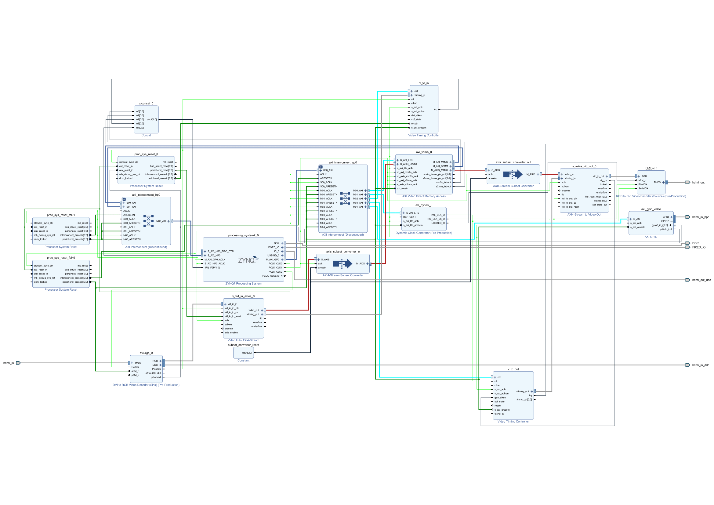

# 🎬 ZYBO Z7 HDMI EXAMPLE DESIGN

**FPGA-BASED HDMI VIDEO PIPELINE WITH REAL-TIME CAPTURE AND DISPLAY ON THE ZYBO Z7 PLATFORM.**

---

## 📝 PROJECT DESCRIPTION

This design implements an **HDMI video passthrough system** on the **Digilent ZYBO Z7** board using the **Zynq-7000 SoC**.  
Video is received from the HDMI input, buffered using **AXI VDMA**, and displayed through the HDMI output in real time.  
A **Test Pattern Generator (TPG)** can also be used as an internal video source when no input is connected.

---

## ⚙️ FEATURES

- Real-time HDMI passthrough and test pattern display  
- AXI4-Stream video pipeline using **VDMA**, **VTC**, and **Clock Wizard**  
- Supports **720p** and **1080p** resolutions  
- Compatible with **Vivado 2024.2+** and **Vitis standalone BSP**

---

## 🧩 SYSTEM BLOCK DIAGRAM

