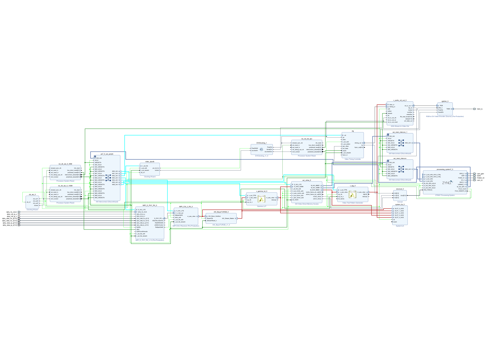
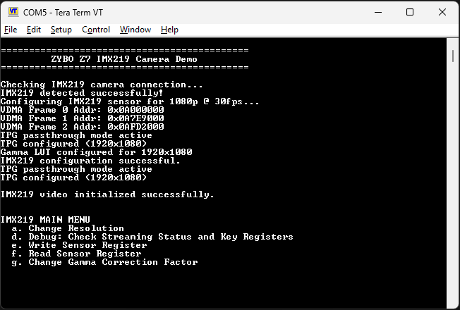

# 🎥 IMX219 MIPI CAMERA INTERFACE ON ZYBO Z7

**FPGA-BASED IMX219 MIPI CAMERA INTERFACE WITH REAL-TIME VIDEO CAPTURE, PROCESSING, AND HDMI DISPLAY ON THE ZYBO Z7 PLATFORM.**

---

## 📝 PROJECT DESCRIPTION

This project implements a complete FPGA-based video capture and display system using the **Sony IMX219 MIPI camera sensor** on the **Digilent ZYBO Z7** board.  
The design receives MIPI CSI-2 video data, processes it through a **MIPI D-PHY and CSI-2 receiver**, and streams frames via **AXI VDMA** to DDR memory.  
The frames are then read back and displayed through a **Video Timing Controller (VTC)** and **HDMI output**.

All hardware IPs are controlled by lightweight **C++ drivers** for the Zynq Processing System, including I2C configuration, GPIO reset, and dynamic resolution/gamma management.  
The system supports **1080p@30fps** and **720p@60fps** modes and provides a UART-based interactive menu for debugging and real-time control.

---

## ⚙️ FEATURES

- Supports **1080p@30fps** and **720p@60fps**
- Modular **C++ driver architecture** (AXI_VDMA, PS_IIC, PS_GPIO, IMX219, VideoOutput)
- **MIPI CSI-2 RX** and **D-PHY RX** integration
- Real-time **gamma correction and test pattern generation**
- **UART menu interface** for runtime configuration
- Compatible with **Vivado 2024.2+** and **Vitis standalone BSP**

---

## 🧩 SYSTEM BLOCK DIAGRAM

---

## 📂 Uart Terminal

